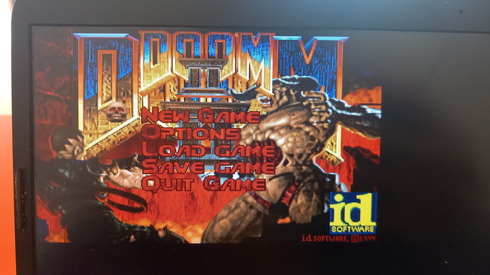

# doom-drm

Doom port using the Linux DRM API



Build the project:

```
make
```

You will need the doom's IWADs files to run it, then run this directly
in the console (no X or wayland session):

```
./doomgeneric -iwad /path/to/iwad/dir/*
```

Keys are `poll`ed directly from `/dev/input/input0`, the screen is
rendered using the `libdrm` api.

Many many thanks to the doomgeneric project for providing an easy to
port version of doom, and ascent12/drm_doc for writing some useful
documentation and examples of Linux DRM.

This project is just me trying to play with Linux DRM by quickly
hacking something in an evening. I had a lot of fun.
